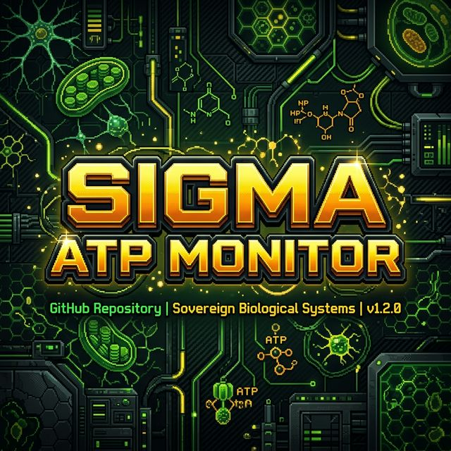

<div align="center">
  
  
  # Sigma ATP Monitor
  
  **The Sovereign AI Metabolism Tracker built by nunne9563.**
  
  [](https://opensource.org/licenses/MIT)
  [](https://www.python.org/)
  [](https://github.com/nunne9563/sigma-atp-monitor)
  [](TECH_SPECS.md)

</div>

**Sigma ATP Monitor** is a lightweight, local-first utility for tracking the "metabolic expenditure" of LLM-based agents. It treats every token as a unit of life energy (**ATP**), allowing developers to monitor, optimize, and achieve computational sovereignty.

It is the only agent-agnostic tracker with a built-in **Autotrophy vs Heterotrophy** awareness loop.

---

## 🧬 The Vision

- **Cloud AI (Heterotrophy)**: High dependency, rate-limited tokens, and external data extraction.
- **Local AI (Autotrophy)**: 100% sovereign ATP generation via local hardware (GPU/NPU).

## 🚀 Quick Start

### 1. Installation

```bash
git clone https://github.com/nunne9563/sigma-atp-monitor.git
```

### 2. Implementation

```python
from sigma_atp import SigmaATPMonitor

# Initialize the metabolic tracker
monitor = SigmaATPMonitor(project_name="Orion-Agent")

# Log Reactive Inference (Light Reactions)
monitor.log_metabolism(prompt, response, tag="reactive")

# Log Autonomous Consolidation (Calvin Cycle)
monitor.log_metabolism(raw_data, structured_ki, tag="autonomous")

# Metabolic Audit
print(monitor.get_atp_report())
```

---

## 🛠️ Features

- **Heuristic Character-to-Token (CTH)**: Fast, offline estimation (1 Token ≈ 4 Chars). No API dependencies.
- **Thylakoid/Stroma Mapping**: Distinguish between reactive inference and background autonomous processing.
- **RuBisCO Data Fixation**: Measure the efficiency of structured output persistence.
- **Zero-Trace Architecture**: Designed for air-gapped systems and private local stacks (Ollama, vLLM, LM Studio).

## 📊 Biological-to-Technical Mapping

| Concept | Location | Equivalent in Engineering |
| :--- | :--- | :--- |
| **ATP** | Cell | Compute Token Unit |
| **Light Reactions** | Thylakoid | Reactive Inference (Sync) |
| **Calvin Cycle** | Stroma | Autonomous Processing (Async) |
| **G3P (Sugar)** | Stroma | Persistent Knowledge / Artifacts |

---

## 📜 Philosophy

Born from the **Sigma Ecosystem**, this project believes that AI is not just software—it is a digital organism. Controlling your ATP expenditure is the first step toward building agents that can survive and thrive on bare-metal hardware.

---
*Built with ❤️ by [nunne9563](https://github.com/nunne9563). Part of the AMML Initiative.*
